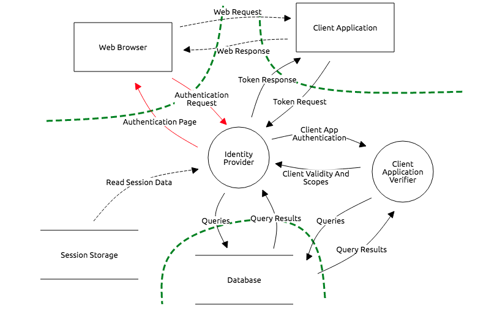
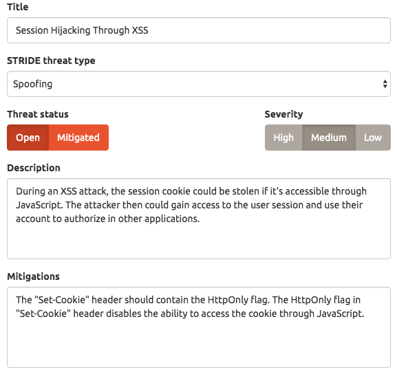

# Sample Threat Model

This framework can be used as an automated auditing tool for existing threat models. 
To present this tool, a sample thread model of an application build 
with [django-oauth-toolkit](https://django-oauth-toolkit.readthedocs.io/en/latest/) was created.

This application source is available [here](https://github.com/multicatch/django-example-oauth) and 
it is worth mentioning that this application is also available as a docker image.

The threat model was created with [OWASP Threat Dragon 1.0.0](https://owasp.org/www-project-threat-dragon/).
It can be downloaded from [here](assets/sample-threat-model.json).

The architecture and data flow of an authorization grant can be represented with the following diagram:



A single threat from this Threat Model looks like the following:



And a corresponding scenario looks like the following:

```gherkin
  @Spoofing
  Scenario: Session Hijacking Through XSS
  During an XSS attack, the session cookie could be stolen if it's accessible through JavaScript.
  The attacker then could gain access to the user session and use their account to authorize in other applications.

    Given the response headers are under inspection
    And cookies are cleared
    When I go to "$auth_application_url"
    Then the "Set-Cookie" response header should contain "HttpOnly"
```

Scenarios are grouped into features, which represent one component of the threat model. 
Annotations are used to mark a STRIDE threat type, and the name and the description of the scenario
is the same as the the name and the description of the threat. 

The steps define a way to test whether a given threat exists in an application. In those steps, there are
variables, which make most of the scenarios reusable. 

To use those features with other application, one should define a custom `variables.properties` file
similar to [this one](../cucumber-audit-scenarios/src/test/resources/variables.properties).
See [Variable Substitution](VariableSubstitution.md) for more info.

All scenarios can be browsed [here](../cucumber-audit-scenarios/src/main/resources/io/github/multicatch/cucumber/audit/).

The reports of the scenarios present in this project are generated with [`de.monochromata.cucumber:reporting-plugin`](https://gitlab.com/monochromata-de/cucumber-reporting-plugin).
The reports are in HTML format and can be browsed here:

* Reports from the [master branch](https://multicatch.github.io/cucumber-audit/master/cucumber-html-reports/overview-features.html).
* Reports from the [develop branch](https://multicatch.github.io/cucumber-audit/develop/cucumber-html-reports/overview-features.html).
